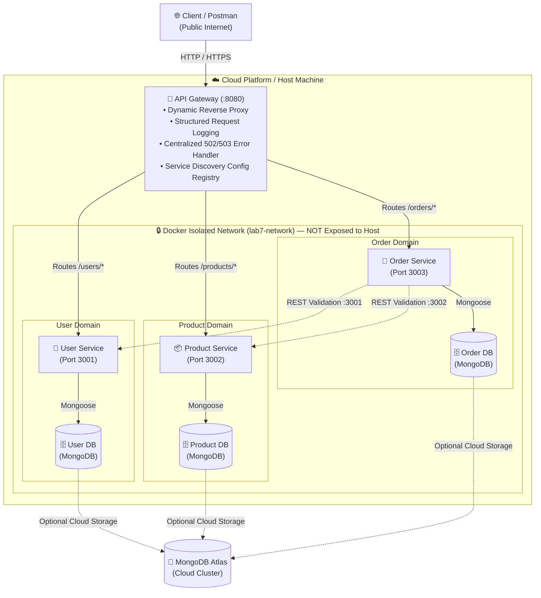

# Web Services & SOA Laboratory — Lab 7
## API Gateway, Configuration-Based Service Discovery & Cloud Deployment

---

## 1. Executive Summary & Objectives

In **Lab 6**, the monolithic backend was decomposed into three independently runnable microservices (**User Service**, **Product Service**, and **Order Service**) communicating directly across a Docker bridge network.

**Lab 7** advances the microservices architecture by:
1. **Building an API Gateway (`api-gateway`)**: Serving as the unified, single entry point for all external client and Postman requests, terminating public traffic and routing requests internally.
2. **Implementing Configuration-Based Service Discovery**: Externalizing service locations into environment variables/registry configuration so downstream service endpoints can be changed without modifying application source code.
3. **Encapsulating Microservices within an Internal Docker Network**: Exposing **only** the API Gateway port (`8080`) to the host/internet, keeping User (`3001`), Product (`3002`), Order (`3003`), and MongoDB instances strictly isolated within `lab7-network`.
4. **Centralizing Cross-Cutting Concerns**: Providing structured request logging, unified health monitoring (`GET /health`), and centralized error handling (clean `502 Bad Gateway` / `503 Service Unavailable` JSON responses when downstream services fail).
5. **Enabling Cloud Deployment**: Packaging the multi-container architecture with configuration-driven settings for deployment on cloud platforms (e.g., Render, Railway, Fly.io, or AWS/GCP container instances) backed by MongoDB Atlas.

---

## 2. End-to-End System Architecture



### Architectural Layering & Boundaries

| Layer | Component | Responsibility | Network Reachability |
| :--- | :--- | :--- | :--- |
| **Client Layer** | Postman / Web Client | Dispatches HTTP requests to a single domain/port. | Public Internet |
| **Edge Gateway** | `api-gateway` (Port `8080`) | Reverse proxy routing (`/users`, `/products`, `/orders`), health check (`/health`), request logging, 502/503 error shielding. | Public Internet (Exposed) |
| **Service Discovery** | `services.config.js` / Env Vars | Holds mapping of service names to network URIs (`USER_SERVICE_URL`, etc.). | Internal Gateway Runtime |
| **Microservices Layer** | `user-service` (:3001)<br>`product-service` (:3002)<br>`order-service` (:3003) | Own business logic, resource validation, inter-service HTTP communication. | `lab7-network` ONLY (Internal) |
| **Data Layer** | `user-db`, `product-db`, `order-db` or MongoDB Atlas | Dedicated database instances per domain ensuring strict data isolation. | `lab7-network` or Atlas Cloud |

---

## 3. Discussion Questions & Analysis

### 3.1. Why Introduce an API Gateway Instead of Direct Client Calls?

In a distributed microservice system, allowing clients (web/mobile browsers, 3rd-party consumers) to communicate directly with individual microservices introduces severe architectural drawbacks:

1. **Unified Single Entry Point vs Client Coupling**:
   - *Without Gateway*: Clients must track IP addresses, hostnames, and ports for dozens of services. If a service is split, renamed, or relocated, clients break.
   - *With Gateway*: Clients talk to a single base URL (`https://gateway.example.com`). The internal topology is completely abstracted away.
2. **Security & Attack Surface Minimization**:
   - *Without Gateway*: Every microservice port (3001, 3002, 3003, databases) must be exposed publicly to the internet, increasing vulnerability surface.
   - *With Gateway*: Only port 8080 is exposed. All microservices reside inside a private virtual network (`lab7-network`), immune to direct external tampering.
3. **Centralization of Cross-Cutting Concerns**:
   - Cross-cutting concerns such as **structured request logging**, **traffic rate limiting**, **authentication / JWT validation**, **CORS policies**, **SSL termination**, and **circuit breaking** are handled once at the gateway rather than duplicated inconsistently across every service.
4. **Standardized Error Handling**:
   - If a backend service crashes or experiences network failure, the gateway intercepts the socket error (`ECONNREFUSED`, `ETIMEDOUT`) and translates it into a uniform JSON response (`502 Bad Gateway` or `503 Service Unavailable`), preventing raw stack traces or unhandled connection resets from reaching the client.

---

### 3.2. Static / Configuration-Based vs Dynamic Service Discovery

| Dimension | Static / Configuration-Based (Lab 7) | Dynamic Service Discovery (Consul, Eureka, k8s DNS) |
| :--- | :--- | :--- |
| **Location Registry** | Environment variables (`.env`, Docker Compose `environment:` block) or static config files. | Centralized dynamic registry server / key-value store (e.g., Consul, Netflix Eureka, etcd, CoreDNS). |
| **Service Registration** | Manually declared at container startup / deploy time. | Automated self-registration via heartbeats on service boot, auto-deregistration on shutdown. |
| **Dynamic Scaling & Replicas** | Requires gateway reconfiguration and restart to add replica IPs. | Gateway/Load Balancer continuously watches registry and immediately routes across 1..N dynamic replicas. |
| **Health Checking & Eviction** | Gateway attempts connection; returns 502/503 upon failure. | Registry sends active health checks; automatically removes unhealthy nodes from the routing pool. |
| **Operational Complexity** | Minimal overhead; zero third-party dependencies; ideal for small-to-medium deployments. | Requires dedicated cluster infrastructure, consensus protocols (Raft/Paxos), and sidecar/agent management. |

**What does Dynamic Service Discovery add that Static Config cannot?**
- **Elastic Auto-Scaling**: When traffic surges and the container orchestrator spins up 10 new instances of `order-service` with dynamic ephemeral IP addresses, dynamic service discovery registers them instantly without gateway restarts or downtime.
- **Client-Side Load Balancing**: Distributes requests across active healthy instances using round-robin, least-connections, or latency-weighted algorithms.
- **Self-Healing Topologies**: Automatically detaches failing container instances before clients experience failed requests.

---

## 4. API Gateway Endpoints & Routing Specification

| Method | Gateway Endpoint | Target Upstream Service | Internal Target URL | Description |
| :--- | :--- | :--- | :--- | :--- |
| **GET** | `/health` | **API Gateway (Self)** | N/A (Local execution) | Returns Gateway operational status & service registry map. |
| **POST** | `/users` | `user-service` | `http://user-service:3001/users` | Creates a new user record. |
| **GET** | `/users` | `user-service` | `http://user-service:3001/users` | Retrieves all users. |
| **GET** | `/users/:id` | `user-service` | `http://user-service:3001/users/:id` | Retrieves a single user by MongoDB ID. |
| **PUT** | `/users/:id` | `user-service` | `http://user-service:3001/users/:id` | Updates user details. |
| **DELETE**| `/users/:id` | `user-service` | `http://user-service:3001/users/:id` | Deletes a user record. |
| **POST** | `/products` | `product-service` | `http://product-service:3002/products` | Creates a new product catalog item. |
| **GET** | `/products` | `product-service` | `http://product-service:3002/products` | Retrieves all catalog products. |
| **GET** | `/products/:id` | `product-service` | `http://product-service:3002/products/:id` | Retrieves product details by ID. |
| **PUT** | `/products/:id` | `product-service` | `http://product-service:3002/products/:id` | Updates product price/stock. |
| **DELETE**| `/products/:id` | `product-service` | `http://product-service:3002/products/:id` | Deletes a product item. |
| **POST** | `/orders` | `order-service` | `http://order-service:3003/orders` | Creates an order (triggers internal REST validation to User & Product services). |
| **GET** | `/orders` | `order-service` | `http://order-service:3003/orders` | Retrieves all placed orders. |
| **GET** | `/orders/:id` | `order-service` | `http://order-service:3003/orders/:id` | Retrieves order details by ID. |

---

## 5. Local Setup & Execution Guide

### Prerequisites
- [Docker Engine & Docker Compose](https://docs.docker.com/get-docker/) installed.
- [Node.js (v18+)](https://nodejs.org/) installed (for running test runner scripts locally).

### 5.1. Starting the Full Stack via Docker Compose
From the project root directory, run:
```bash
docker compose up --build
```

**Docker Compose Verification:**
- Only the `api-gateway` binds to host port `8080:8080`.
- Microservices (`user-service`, `product-service`, `order-service`) use `expose:` for internal communication on `lab7-network`.

### 5.2. Verifying Gateway Health
```bash
curl http://localhost:8080/health
```
**Sample Response:**
```json
{
  "service": "api-gateway",
  "status": "UP",
  "port": 8080,
  "timestamp": "2026-09-25T14:30:00.000Z",
  "serviceRegistry": {
    "user": {
      "name": "User Service",
      "path": "/users",
      "targetUrl": "http://user-service:3001"
    },
    "product": {
      "name": "Product Service",
      "path": "/products",
      "targetUrl": "http://product-service:3002"
    },
    "order": {
      "name": "Order Service",
      "path": "/orders",
      "targetUrl": "http://order-service:3003"
    }
  },
  "version": "1.0.0"
}
```

### 5.3. Running the Automated Test Suite
An end-to-end automated test runner is provided in `test_gateway_runner.js`. Execute it with:
```bash
node test_gateway_runner.js http://localhost:8080
```
This tests:
1. Gateway health check (`/health`).
2. User creation, retrieval, and updates via Gateway.
3. Product catalog operations via Gateway.
4. Cross-service order processing (`Gateway` -> `Order Service` -> internal REST validation with `User` & `Product` services).
5. Validation failures (404 on non-existent IDs).
6. Gateway 404 handler for invalid routes.

---

## 6. Proving Config-Based Service Discovery (No Code Change)

To prove that the API Gateway routes dynamically based on configuration without changing a single line of JavaScript route code:

1. In `docker-compose.yml` (or `.env`), modify an environment variable, for example:
   ```yaml
   api-gateway:
     environment:
       - USER_SERVICE_URL=http://user-service-backup:3001
   ```
2. Restart the gateway:
   ```bash
   docker compose up -d api-gateway
   ```
3. Check `GET /health` or send a request to `GET /users`:
   - The health check registry instantly reflects the new URL (`http://user-service-backup:3001`).
   - The gateway routes traffic to the new address immediately without any modifications in `gateway.routes.js` or `server.js`.

---

## 7. Centralized Error Handling Demonstration (502 / 503)

If any microservice is stopped or becomes unreachable:
1. Stop the User Service container:
   ```bash
   docker stop user-service
   ```
2. Make a request through the gateway:
   ```bash
   curl -i http://localhost:8080/users
   ```
3. **Gateway Response (`503 Service Unavailable` / `502 Bad Gateway`):**
   ```json
   {
     "success": false,
     "statusCode": 503,
     "error": "Service Unavailable",
     "message": "The upstream microservice 'User Service' is currently unreachable or failed to respond.",
     "details": {
       "code": "ECONNREFUSED",
       "targetService": "User Service",
       "targetUrl": "http://user-service:3001",
       "requestedPath": "/users"
     },
     "timestamp": "2026-09-25T14:32:00.000Z"
   }
   ```
4. Restart the service to resume normal routing:
   ```bash
   docker start user-service
   ```

---

## 8. Cloud Deployment Guide & MongoDB Atlas Integration (Part C)

### 8.1. Configuring MongoDB Atlas Connection (No Local Docker DB Needed)

The microservices are built to seamlessly connect to your **MongoDB Atlas** cloud cluster instead of local Docker Mongo containers.

1. **Copy the environment template**:
   ```bash
   cp .env.example .env
   ```
2. **Set your MongoDB Atlas Connection Strings in `.env`**:
   ```ini
   # If using dedicated databases on the same Atlas cluster:
   USER_MONGO_URI=mongodb+srv://<username>:<password>@cluster0.mongodb.net/userdb?retryWrites=true&w=majority
   PRODUCT_MONGO_URI=mongodb+srv://<username>:<password>@cluster0.mongodb.net/productdb?retryWrites=true&w=majority
   ORDER_MONGO_URI=mongodb+srv://<username>:<password>@cluster0.mongodb.net/orderdb?retryWrites=true&w=majority
   ```
   *(Or specify a single `MONGO_URI` if sharing a common database).*

3. **Running Application Containers with MongoDB Atlas (No Mongo Docker containers)**:
   Use `docker-compose.atlas.yml` which spins up **only** the 4 application containers (`api-gateway`, `user-service`, `product-service`, `order-service`):
   ```bash
   docker compose -f docker-compose.atlas.yml up --build
   ```

---

### 8.2. Option 1: Deployment on Render / Railway / Fly.io

1. **Deploy Microservices as Web / Private Services**:
   - Push your code to your GitHub repository.
   - On **Render** (using `render.yaml` or creating Web Services manually):
     - **User Service**: Set `MONGO_URI` (or `USER_MONGO_URI`) to your MongoDB Atlas connection string.
     - **Product Service**: Set `MONGO_URI` (or `PRODUCT_MONGO_URI`) to your MongoDB Atlas connection string.
     - **Order Service**: Set `MONGO_URI` (or `ORDER_MONGO_URI`) to MongoDB Atlas connection string, and set `USER_SERVICE_URL` and `PRODUCT_SERVICE_URL` to the internal or public URL of your deployed User and Product services.
2. **Deploy API Gateway as Public Web Service**:
   - Point to `api-gateway/` directory.
   - Configure Environment Variables:
     - `PORT`: `8080` (or leave default `$PORT`)
     - `USER_SERVICE_URL`: `<deployed-user-service-url>`
     - `PRODUCT_SERVICE_URL`: `<deployed-product-service-url>`
     - `ORDER_SERVICE_URL`: `<deployed-order-service-url>`
     - `PROXY_TIMEOUT_MS`: `10000`
3. **Verify Public Gateway URL**:
   - Render assigns a public HTTPS address for the API Gateway: `https://soa-api-gateway-bl6i.onrender.com`.
   - Run the automated test suite against your live cloud deployment:
     ```bash
     node test_gateway_runner.js https://soa-api-gateway-bl6i.onrender.com
     ```

---

### 8.3. Option 2: Deployment via Docker Compose on Cloud VM (AWS EC2 / GCP / DigitalOcean)

1. Provision a Linux VM and install Docker & Docker Compose.
2. Clone this repository onto the VM.
3. Create `.env` and set your MongoDB Atlas URIs.
4. Run:
   ```bash
   docker compose -f docker-compose.atlas.yml up -d --build
   ```
5. Allow inbound traffic on port `8080` in your Cloud Security Group / Firewall.
6. Test using Postman / runner against `http://<YOUR_VM_PUBLIC_IP>:8080`.

---

## 9. Postman Collection & Testing Instructions

1. Open Postman.
2. Click **Import** and select `Lab7_Gateway_Microservices.postman_collection.json`.
3. Set the collection variable `baseUrl` to:
   - Local: `http://localhost:8080`
   - Cloud: `https://your-cloud-gateway-url.onrender.com`
4. Run the collection using the **Postman Collection Runner**.
5. All tests verify:
   - Status code assertions (`200 OK`, `201 Created`, `404 Not Found`, `502/503 Unreachable`).
   - Dynamic variable propagation (`userId`, `productId`, `orderId`).

---

## 10. Written Reflection (5-8 Lines)

> Introducing an API Gateway and cloud deployment fundamentally transformed the architecture from an unshielded collection of microservices into an enterprise-grade, cohesive cloud system. Compared to Lab 6, clients now interact with a single, secure entry point rather than managing multiple ports and distributed network endpoints. Internal service topology is cleanly abstracted, significantly reducing client coupling and attack surface. Furthermore, externalizing service discovery into environment configuration enables dynamic redeployments and URL updates without code refactoring. Centralized logging and 502/503 error handling provide robust observability and fault shielding, ensuring resilient operations across distributed cloud infrastructure.

---

## 11. Assignment Checklist

| Requirement | Implementation Status | Evidence |
| :--- | :---: | :--- |
| **Part A: API Gateway Service** | ✅ Completed | `api-gateway/` created with Express & reverse proxying. |
| **Routes to User, Product, Order** | ✅ Completed | `/users`, `/products`, `/orders` routed dynamically. |
| **Health Check Endpoint** | ✅ Completed | `GET /health` reports Gateway status & service map. |
| **Request Logging & Error Handling**| ✅ Completed | `gatewayLogger` + centralized `502/503` error interceptor. |
| **Port Exposure Boundary** | ✅ Completed | Only port `8080` exposed in `docker-compose.yml`. |
| **Part B: Service Discovery** | ✅ Completed | `services.config.js` registry driven by environment variables. |
| **Static vs Dynamic Discussion** | ✅ Completed | Comprehensive analysis in README Section 3.2. |
| **Part C: Cloud Deployment Ready** | ✅ Completed | Full cloud deployment guide & Atlas configuration in Section 8. |
| **Postman Test Collection** | ✅ Completed | `Lab7_Gateway_Microservices.postman_collection.json`. |
| **Automated Test Suite** | ✅ Completed | `test_gateway_runner.js`. |
| **Written Reflection** | ✅ Completed | 5-8 lines reflection included in Section 10. |
